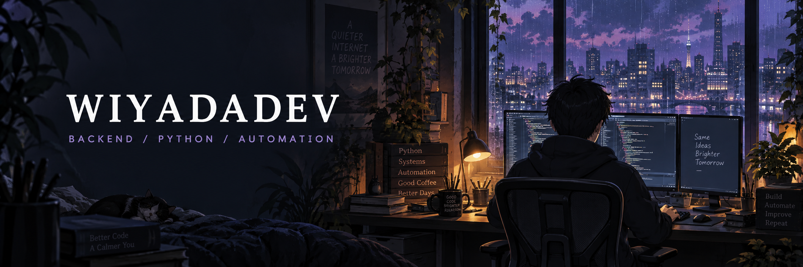

<p align="center">
  
</p>

<p align="center">
  <b>Building bots. Solving problems. Creating freedom.</b><br />
  <sub>Computer Engineering · Backend Development · Thoughtful Automation</sub>
</p>

<p align="center">
  <a href="https://github.com/Wiyadadev"></a>
  <a href="https://linkedin.com/in/Wiyadadev"></a>
</p>

---

### 🌙 About Me

I'm a **final-year Computer Engineering student** focused on backend development. I enjoy turning real-world problems into useful APIs, bots, and automated workflows.

```python
wiyadadev = {
    "focus": ["Python", "Backend Development", "Automation"],
    "learning": [
        "FastAPI", "PostgreSQL", "SQLAlchemy",
        "Docker", "Redis", "Data Structures & Algorithms"
    ],
    "goal": "Build clean, reliable systems that last."
}
```

> Write clean code. Keep learning. Build something useful.

### 🧰 Tech Stack

<p><b>Backend &amp; systems · currently exploring</b></p>
<p>
  
</p>
<p>
  
  
</p>

<p><b>Web &amp; development tools</b></p>
<p>
  
</p>

### 🪐 Featured Projects

| Project | What I'm building |
| :--- | :--- |
| **[Vvyada Automation](https://github.com/Wiyadadev/Vvyada_Automation)** | AI automation for content creation and workflow optimization. |
| **[AI Telegram Bot](https://github.com/Wiyadadev/Ai-Telegram-bot)** | A Python Telegram bot for product ordering with payment integration. |
| **Lil Club Samui · private project** | An AI-powered web app for bars with ordering and personalized drink recommendations. |
| **[Wiyadadev.github.io](https://github.com/Wiyadadev/Wiyadadev.github.io)** | A responsive developer portfolio showcasing projects and experience. |
| **[Portfolio](https://github.com/Wiyadadev/portfolio)** | My personal portfolio featuring frontend projects and skills. |

### 📊 GitHub Activity

<p align="center">
  <a href="https://github.com/Wiyadadev?tab=overview">
    
  </a>
</p>

<p align="center">
  <a href="https://github.com/Wiyadadev?tab=repositories">Explore my repositories ↗</a>
</p>

---

<p align="center"><sub>One problem, one commit, one step forward.</sub></p>
